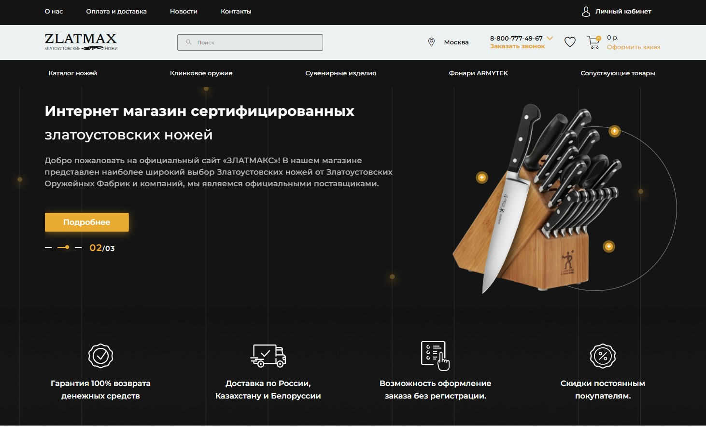

<h1 align="center">Верстка сайта Интернет-магазина ZLATMAX</h1>
<h2 align="center">Как посмотреть</h2>

Результат верстки можно посмотреть по ссылкам (GitHub Pages):

<ul>
<li><a href="https://kovalinam.github.io/zlatmax_dep/#">Главная страница</a></li>
<li><a href="https://kovalinam.github.io/zlatmax_dep/catalog.html">Страница каталога товаров</a></li>
<li><a href="https://kovalinam.github.io/zlatmax_dep/product.html">Карточка товара</a></li>
</ul>
<h4><a href="https://disk.yandex.ru/d/4Uz_jHI-T_NSPw">Макет Figma</a></h4>
<h2 align="center">Описание проекта</h2>

Проект выполнен для отработки навыков верстки с использованием HTML5, CSS, SCSS, чистого JavaScript и Gulp.

Вертска адаптивная, семантическая. Код HTML проверен в валидаторе.

<h2 align="center">Скриншот</h2>

